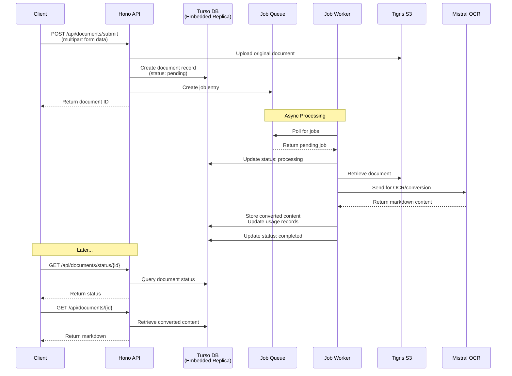
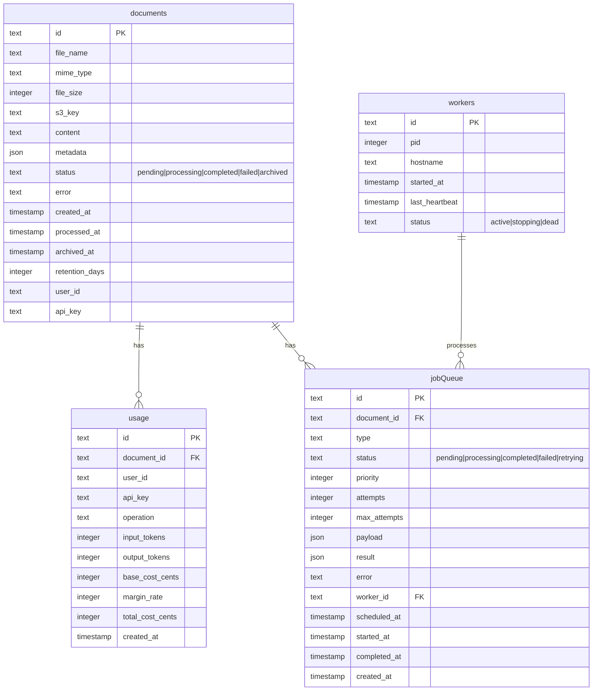

# Convert Docs API v2

A streamlined document-to-markdown conversion API using Turso (edge SQLite), Tigris S3, and Mistral OCR.

## Features

- 📄 Document to Markdown conversion using Mistral OCR ($1 per 1000 pages)
- 💾 Document retention and archival (configurable retention period)
- 📊 Usage tracking with margin-based billing
- 🚀 Edge-optimized with Turso database using embedded replicas
- 💨 Local SQLite (libsql) for fast reads with automatic sync to Turso
- 🗄️ S3-compatible storage with Tigris (using Bun's native S3 helpers)
- ⚡ Async job processing with database-backed queue
- 📦 Support for large files up to 1GB
- 🔒 Optional API key authentication

## Architecture



## Setup

1. Install dependencies:
```bash
bun install
```

2. Configure environment variables:
```bash
cp .env.example .env
# Edit .env with your credentials
```

3. Setup database:
```bash
# Generate database types
bun run db:generate
# Push schema changes
bun run db:push
```
Or `bun run scripts/setup-db.ts`

4. Start the server:
```bash
bun run dev
```

## API Endpoints

### Submit Document
```bash
POST /api/documents/submit
Content-Type: multipart/form-data

file: <file>
retentionDays: 365 (optional, 1-3650)
```

### Check Status
```bash
GET /api/documents/status/:id
```

### Download Converted Document
```bash
GET /api/documents/:id
GET /api/documents/:id?format=json
```

### Get Original File
```bash
GET /api/documents/:id/original
```

### Usage Summary
```bash
GET /api/usage/summary?startDate=2024-01-01T00:00:00Z&endDate=2024-12-31T23:59:59Z
```

### Usage Breakdown
```bash
GET /api/usage/breakdown
```

## Environment Variables

- `TURSO_DATABASE_URL`: Turso database URL (remote sync target)
- `TURSO_AUTH_TOKEN`: Turso authentication token
- `TURSO_SYNC_INTERVAL`: Sync interval in seconds (default: 60)
- `LOCAL_DB_PATH`: Local SQLite file path (default: ./src/db/convert-docs.db)
- `DB_ENCRYPTION_KEY`: Optional encryption key for local database
- `AWS_ACCESS_KEY_ID`: S3 access key (works with Tigris)
- `AWS_SECRET_ACCESS_KEY`: S3 secret key
- `AWS_ENDPOINT_URL_S3`: S3 endpoint (default: https://fly.storage.tigris.dev)
- `S3_BUCKET`: S3 bucket name
- `MISTRAL_API_KEY`: Mistral API key for OCR
- `API_KEY`: Optional API key for authentication

## Embedded Replicas

This API uses Turso's embedded replicas for optimal performance:

- **Local First**: All reads are served from the local SQLite file (microsecond latency)
- **Auto Sync**: Writes go to remote Turso and sync back automatically
- **Resilient**: Works offline, syncs when connection restored
- **Encrypted**: Optional encryption at rest for local database

The local database file is stored at `./src/db/convert-docs.db` by default.

## Database Schema



### Documents Table
- Stores document metadata and converted content
- Supports archival with configurable retention periods
- Tracks processing status and errors

### Usage Table
- Records all operations with token counts
- Calculates costs with configurable margin rates
- Supports filtering by user/API key

### Job Queue Table
- Database-backed job queue for async processing
- Supports retries with exponential backoff
- Priority-based processing

### Workers Table
- Tracks active worker processes
- Manages worker lifecycle with heartbeat monitoring
- Enables distributed job processing

## Cost Calculation

Base cost: **Mistral OCR** - $0.001 per page ($1 per 1000 pages)

Total cost = Base cost × (1 + margin rate)
Default margin rate: 30%

Example: Processing 1000 pages costs $1.30 with default 30% margin

## Development

```bash
# Generate database types
bun run db:generate

# Push schema changes
bun run db:push

# View database
bun run db:studio
```
