# Ilios API

A document-to-markdown conversion API built with Bun, featuring immediate OCR, batch processing, and local-first architecture.

## Features
- 📄 **Document Conversion** - PDF/images to Markdown using Mistral OCR
- 💾 **Document Retention** - Configurable archival (1-3650 days)
- 📊 **Usage Tracking** - Token-based billing with configurable margins
- 🚀 **Local-First Database** - SQLite with optional Turso sync
- 🗄️ **S3-Compatible Storage** - Tigris/Cloudflare R2 support
- ⚡ **Atomic Job Queue** - Transaction-based job claiming
- 🔄 **Automatic Retries** - Exponential backoff (5s, 10s, 20s)
- 📦 **Large File Support** - Up to 1GB with streaming
- 🔒 **Optional Auth** - API key authentication
- 🛡️ **Graceful Shutdown** - Waits for active jobs
### Roadmap
- [ ] ACL for sanctioned usage
- [ ] Webhook notifications for job completion
- [ ] ZIP download format for batches
- [ ] Rate limiting per API key
- [x] Bun Worker threads with optimized IPC (v2.1.2)
- [ ] Parallel batch uploads with concurrency control
- [ ] Bun SQLite for local-only mode (2-3x faster queries)

## Quick Setup

### Prerequisites
- [Bun](https://bun.sh) v1.0+ (runtime & package manager)
- [Mistral API Key](https://console.mistral.ai/) (for OCR)
- [Tigris/S3 credentials](https://www.tigrisdata.com/) (for storage)
- Optional: [Turso account](https://turso.tech/) (for edge sync)

### Installation

1. **Clone and install:**
```bash
git clone https://github.com/tobalo/ilios.git
cd ilios/api
bun install
```

2. **Configure environment:**
```bash
cp .env.example .env
```

Edit `.env` with your credentials:
```bash
# Required - Mistral OCR
MISTRAL_API_KEY=your_mistral_api_key_here

# Required - S3 Storage (Tigris example)
AWS_ACCESS_KEY_ID=tid_xxx
AWS_SECRET_ACCESS_KEY=tsec_xxx
AWS_ENDPOINT_URL_S3=https://fly.storage.tigris.dev
S3_BUCKET=your-bucket-name

# Optional - API Key Authentication
API_KEY=your_secure_api_key_here

# Optional - Database (local-only by default)
USE_EMBEDDED_REPLICA=false
LOCAL_DB_PATH=./data/ilios.db
```

3. **Initialize database:**
```bash
bun run db:push
```
If desired extend or modify schema with drizzle studio or edit directly `./src/db/schema.ts`
```bash
bun run db:studio # Make your changes
bun run db:generate
bun run db:push
```

4. **Start server:**
```bash
bun run dev
```

Server starts at `http://localhost:1337`
- API docs: `http://localhost:1337/docs` (Swagger UI)
- Health check: `http://localhost:1337/health`
- Endpoints: `http://localhost:1337/` (list all)

### Quick Start Examples

**Immediate OCR (synchronous):**
```bash
curl -X POST http://localhost:1337/v1/convert \
  -H "Authorization: Bearer $API_KEY" \
  -F "file=@document.pdf"
```

**Batch Processing (async):**
```bash
curl -X POST http://localhost:1337/v1/batch/submit \
  -H "Authorization: Bearer $API_KEY" \
  -F "files=@doc1.pdf" \
  -F "files=@doc2.pdf" \
  -F "files=@doc3.pdf"
```

## Benchmarks & Performance
Latest benchmarkets can be found in `/benchmarks/latest_results.json`

### Recommended Configuration
```bash
# Production settings
WORKER_COUNT=4              # Match CPU cores
MAX_CONCURRENT_JOBS=10      # Per worker
S3_MULTIPART_THRESHOLD=50MB # Chunked uploads
DB_WAL_MODE=true           # Concurrent access
```

---

## API Usage

### Authentication

If `API_KEY` is set in `.env`, include it in requests:

```bash
# Header-based auth (recommended)
curl -H "Authorization: Bearer $API_KEY" ...

# Query param (alternative)
curl "...?apiKey=$API_KEY"
```

To disable authentication, remove `API_KEY` from `.env`.

---

## Technical Documentation

### Architecture

### System Overview

```mermaid
graph TB
    subgraph CORE["Ilios API Server (Bun Runtime)"]
        API[Hono API<br/>Routes & Middleware<br/>Bun Native I/O]
        JP[Job Processor<br/>Worker Manager<br/>IPC Communication]
        DB[(SQLite DB<br/>./data/ilios.db<br/>WAL Mode<br/>SQLITE_BUSY Retry)]
        
        subgraph "Worker Threads (Bun Worker)"
            W0{{Worker 0<br/>postMessage IPC<br/>Atomic Claim<br/>Shared DB<br/>Retry Logic}}
            W1{{Worker 1<br/>postMessage IPC<br/>Atomic Claim<br/>Shared DB<br/>Retry Logic}}
        end
        
        API -.-> JP
        API -->|Read/Write<br/>WAL Mode| DB
        JP <-->|postMessage<br/>2-241x faster| W0
        JP <-->|postMessage<br/>2-241x faster| W1
        JP -->|Cleanup Jobs| DB
        
        W0 -->|Atomic Claim<br/>withRetry helper| DB
        W1 -->|Atomic Claim<br/>withRetry helper| DB
    end
    
    subgraph EXT["External Cloud Services"]
        EXT_S3[("☁️ S3 Storage<br/>(Tigris)<br/>Bun.write streaming")]
        EXT_MISTRAL[("🤖 Mistral OCR<br/>API")]
    end
    
    API -->|Upload Files<br/>Multipart >50MB| EXT_S3
    W0 -->|Bun.write Download<br/>Zero-Copy| EXT_S3
    W1 -->|Bun.write Download<br/>Zero-Copy| EXT_S3
    
    W0 -->|OCR Request| EXT_MISTRAL
    W1 -->|OCR Request| EXT_MISTRAL
    
    style CORE fill:#e3f2fd,stroke:#1976d2,stroke-width:3px,color:#000
    style EXT fill:#fce4ec,stroke:#c2185b,stroke-width:3px,color:#000
    style DB fill:#e1f5ff,stroke:#0288d1,stroke-width:3px,color:#000
    style API fill:#f3e5f5,stroke:#7b1fa2,stroke-width:2px,color:#000
    style JP fill:#fff3e0,stroke:#f57c00,stroke-width:2px,color:#000
    style W0 fill:#e8f5e9,stroke:#388e3c,stroke-width:2px,color:#000
    style W1 fill:#e8f5e9,stroke:#388e3c,stroke-width:2px,color:#000
    style EXT_S3 fill:#ffebee,stroke:#c2185b,stroke-width:2px,color:#000
    style EXT_MISTRAL fill:#ffebee,stroke:#c2185b,stroke-width:2px,color:#000
```



### Request Flow (Detailed Sequence)


### Worker Lifecycle & Job States


## Directory Structure

```
ilios/api/
├── src/
│   ├── db/
│   │   ├── schema.ts              # Drizzle ORM schema definitions
│   │   └── migrations/            # Database migrations
│   ├── middleware/
│   │   ├── auth.ts                # API key authentication
│   │   └── error.ts               # Global error handler
│   ├── routes/
│   │   └── v1/
│   │       ├── convert.ts         # Immediate conversion endpoint
│   │       ├── batch.ts           # Batch processing endpoints
│   │       ├── documents.ts       # Document endpoints (legacy)
│   │       └── usage.ts           # Usage tracking endpoints
│   ├── services/
│   │   ├── database.ts            # SQLite/Turso + withRetry() helper
│   │   ├── job-processor-worker.ts # Worker thread manager
│   │   ├── mistral.ts             # Mistral OCR integration
│   │   ├── s3.ts                  # S3-compatible storage
│   │   └── index.ts               # Service initialization
│   ├── workers/
│   │   └── job-worker-thread.ts   # Worker thread (Bun Worker API)
│   ├── index.ts                   # Main server entry point
│   └── openapi.ts                 # OpenAPI/Swagger spec
├── data/                          # gitignored, auto-created
│   ├── ilios.db                   # Local SQLite database (shared)
│   ├── ilios.db-shm               # WAL shared memory
│   ├── ilios.db-wal               # WAL write-ahead log
│   └── tmp/                       # Temp files for large uploads
├── drizzle.config.ts              # Drizzle Kit configuration
├── package.json
├── tsconfig.json
├── CLAUDE.md                      # AI assistant context
└── README.md
```


### Endpoint Reference

#### Immediate Conversion (v1 - No Queue)

Convert documents instantly with synchronous processing (no S3 upload, no job queue):

```bash
# Get markdown response
curl -X POST http://localhost:1337/v1/convert \
  -H "Authorization: Bearer your_api_key" \
  -F "file=@document.pdf"

# Get JSON response with metadata
curl -X POST http://localhost:1337/v1/convert \
  -H "Authorization: Bearer your_api_key" \
  -F "file=@document.pdf" \
  -F "format=json"
```

**Response (JSON format):**
```json
{
  "id": "cm5xabc123...",
  "content": "# Extracted Markdown\n\nDocument content...",
  "metadata": {
    "model": "mistral-ocr-latest",
    "extractedPages": 5,
    "processingTimeMs": 2340,
    "fileName": "document.pdf",
    "fileSize": 1234567,
    "mimeType": "application/pdf"
  },
  "usage": {
    "prompt_tokens": 1500,
    "completion_tokens": 0,
    "total_tokens": 1500
  },
  "downloadUrl": "/api/documents/cm5xabc123..."
}
```

**Response (Markdown format):**
```markdown
# Extracted Markdown

Document content...
```
*Headers: `X-Document-Id: cm5xabc123...`, `X-Processing-Time-Ms: 2340`, `X-Extracted-Pages: 5`*

**Note:** Document is saved to database for later retrieval via `/api/documents/:id` endpoint.

#### Batch Processing (v1)

Submit multiple documents for asynchronous processing:

```bash
# Submit batch
curl -X POST http://localhost:1337/v1/batch/submit \
  -H "Authorization: Bearer your_api_key" \
  -F "files=@doc1.pdf" \
  -F "files=@doc2.pdf" \
  -F "files=@doc3.pdf" \
  -F "priority=8" \
  -F "retentionDays=365"
```

**Response:**
```json
{
  "batchId": "cm5xabc123...",
  "status": "queued",
  "totalDocuments": 3,
  "documents": [
    { "id": "doc_1", "fileName": "doc1.pdf", "fileSize": 123456, "status": "pending" },
    { "id": "doc_2", "fileName": "doc2.pdf", "fileSize": 234567, "status": "pending" },
    { "id": "doc_3", "fileName": "doc3.pdf", "fileSize": 345678, "status": "pending" }
  ],
  "statusUrl": "/v1/batch/status/cm5xabc123..."
}
```

**Check batch status:**
```bash
curl http://localhost:1337/v1/batch/status/cm5xabc123 \
  -H "Authorization: Bearer your_api_key"
```

**Response:**
```json
{
  "batchId": "cm5xabc123...",
  "status": "processing",
  "progress": {
    "total": 3,
    "pending": 0,
    "processing": 1,
    "completed": 2,
    "failed": 0
  },
  "createdAt": "2024-01-15T10:30:00.000Z",
  "downloadUrl": null
}
```

**Download completed batch:**
```bash
curl http://localhost:1337/v1/batch/download/cm5xabc123?format=jsonl \
  -H "Authorization: Bearer your_api_key" \
  -o batch-results.jsonl
```

**JSONL format:**
```jsonl
{"id":"doc_1","fileName":"doc1.pdf","status":"completed","content":"# Document 1\n...","metadata":{...}}
{"id":"doc_2","fileName":"doc2.pdf","status":"completed","content":"# Document 2\n...","metadata":{...}}
{"id":"doc_3","fileName":"doc3.pdf","status":"failed","error":"OCR processing failed: timeout"}
```

#### Submit Document for Conversion (Legacy)

```bash
curl -X POST http://localhost:1337/api/documents/submit \
  -H "Authorization: Bearer your_api_key" \
  -F "file=@path/to/document.pdf" \
  -F "retentionDays=365"
```

**Response:**
```json
{
  "id": "cm5xabc123...",
  "status": "pending",
  "fileName": "document.pdf",
  "fileSize": 1234567,
  "retentionDays": 365,
  "createdAt": "2024-01-15T10:30:00.000Z"
}
```

#### Check Document Status

```bash
curl http://localhost:1337/api/documents/status/cm5xabc123 \
  -H "Authorization: Bearer your_api_key"
```

**Response (Processing):**
```json
{
  "id": "cm5xabc123...",
  "status": "processing",
  "fileName": "document.pdf"
}
```

**Response (Completed):**
```json
{
  "id": "cm5xabc123...",
  "status": "completed",
  "fileName": "document.pdf",
  "metadata": {
    "pages": 10,
    "processingTimeMs": 5432,
    "model": "pixtral-12b-2409"
  }
}
```

#### Download Converted Markdown

```bash
# Get raw markdown
curl http://localhost:1337/api/documents/cm5xabc123 \
  -H "Authorization: Bearer your_api_key"

# Get JSON response
curl http://localhost:1337/api/documents/cm5xabc123?format=json \
  -H "Authorization: Bearer your_api_key"
```

**Response (markdown):**
```markdown
# Document Title

Document content in markdown format...
```

**Response (JSON):**
```json
{
  "id": "cm5xabc123...",
  "content": "# Document Title\n\nDocument content...",
  "metadata": {...}
}
```

#### Get Original Document

```bash
curl http://localhost:1337/api/documents/cm5xabc123/original \
  -H "Authorization: Bearer your_api_key" \
  -o original_document.pdf
```

#### Usage Tracking

```bash
# Summary for date range
curl "http://localhost:1337/api/usage/summary?startDate=2024-01-01T00:00:00Z&endDate=2024-12-31T23:59:59Z" \
  -H "Authorization: Bearer your_api_key"

# Detailed breakdown
curl http://localhost:1337/api/usage/breakdown \
  -H "Authorization: Bearer your_api_key"
```

**Response (Summary):**
```json
{
  "totalDocuments": 150,
  "totalOperations": 150,
  "totalInputTokens": 50000,
  "totalOutputTokens": 25000,
  "totalCostCents": 13000
}
```

## Environment Variables

- `USE_EMBEDDED_REPLICA`: Set to 'true' for Turso sync, 'false' for local-only (default: false)
- `LOCAL_DB_PATH`: Local SQLite file path (default: ./data/ilios.db)
- `TURSO_DATABASE_URL`: Turso database URL (only if USE_EMBEDDED_REPLICA=true)
- `TURSO_AUTH_TOKEN`: Turso authentication token (only if USE_EMBEDDED_REPLICA=true)
- `TURSO_SYNC_INTERVAL`: Sync interval in seconds (default: 60)
- `DB_ENCRYPTION_KEY`: Optional encryption key for local database
- `AWS_ACCESS_KEY_ID`: S3 access key
- `AWS_SECRET_ACCESS_KEY`: S3 secret key
- `AWS_ENDPOINT_URL_S3`: S3 endpoint URL
- `S3_BUCKET`: S3 bucket name
- `MISTRAL_API_KEY`: Mistral API key for OCR
- `API_KEY`: Optional API key for authentication

## Database Modes

### Local-Only (Default)
Uses local SQLite database only - no remote sync required:
```bash
USE_EMBEDDED_REPLICA=false
LOCAL_DB_PATH=./data/ilios.db
```

### Turso Embedded Replica (Optional)
Enable Turso sync for edge-optimized performance:
```bash
USE_EMBEDDED_REPLICA=true
LOCAL_DB_PATH=./data/ilios.db
TURSO_DATABASE_URL=libsql://your-database.turso.io
TURSO_AUTH_TOKEN=your-token
```

Benefits of embedded replicas:
- **Local First**: All reads from local SQLite (microsecond latency)
- **Auto Sync**: Writes sync to Turso automatically
- **Resilient**: Works offline, syncs when reconnected
- **Encrypted**: Optional encryption at rest

## Database Schema


### Documents Table
- Stores document metadata and converted content
- Supports archival with configurable retention periods
- Tracks processing status and errors

### Usage Table
- Records all operations with token counts
- Calculates costs with configurable margin rates
- Supports filtering by user/API key

### Job Queue Table
- Database-backed job queue for async processing
- Supports retries with exponential backoff (100ms, 200ms, 400ms, 800ms, 1600ms)
- Priority-based processing
- Atomic job claiming via `withRetry()` helper

### Batches Table
- Groups multiple documents for batch processing
- Tracks progress (total, completed, failed counts)
- Supports priority-based processing
- Automatic status updates based on document completion

## Cost Calculation

Base cost: **Mistral OCR** - $0.001 per page ($1 per 1000 pages)

Total cost = Base cost × (1 + margin rate)
Default margin rate: 30%

Example: Processing 1000 pages costs $1.30 with default 30% margin

## Development

### Database Management

```bash
# Push schema changes (first-time setup or schema updates)
bun run db:push

# Generate migrations from schema
bun run db:generate

# Run migrations
bun run db:migrate

# View database in Drizzle Studio
bun run db:studio
```

### Project Scripts

```bash
bun run dev          # Start dev server with hot reload
bun run db:push      # Sync schema to database
bun run db:generate  # Generate migration files
bun run db:studio    # Open Drizzle Studio
```

### Worker Architecture (v2.1.2)

The API uses Bun Worker threads for true parallelism with optimized IPC:

- **Main Process**: Handles HTTP requests, manages worker thread lifecycle
- **Worker Threads**: Created via `new Worker()`, use `postMessage` for IPC (2-241x faster than Node.js)
- **Database Connections**: Each thread creates its own connection to `./data/ilios.db` (WAL mode)
- **Atomic Job Claiming**: Transaction-based with `withRetry()` helper (100ms, 200ms, 400ms, 800ms, 1600ms)
- **Automatic Retries**: Failed jobs retry with exponential backoff (5s, 10s, 20s)
- **Graceful Shutdown**: Workers wait for active jobs (5-second timeout)
- **IPC Communication**: Bun's optimized `postMessage` with fast paths for strings and simple objects
- **No Heartbeats**: Cleanup relies on job timeout detection (>5 minutes = orphaned)

**Key Differences from Process-Based Workers:**
- ✅ **2-241x faster IPC** - Bun's `postMessage` optimizations
- ✅ **Instant startup** - No process spawn overhead
- ✅ **True threads** - OS-level parallelism, not separate processes
- ✅ **Simpler architecture** - No worker registration table or heartbeat mechanism
- ⚠️ **Own DB connections** - Each thread creates its own connection (contention handled by `withRetry()`)

**Job Processing Flow:**
1. Main process signals workers: `worker.postMessage({type: 'process'})`
2. Workers atomically claim jobs using `withRetry()` wrapper
3. Worker downloads files using `Bun.write()` for >10MB, direct buffer for <10MB
4. Worker sends OCR to Mistral, stores result in DB with `withRetry()`
5. Worker sends completion: `postMessage({type: 'completed', jobId})`
6. On error: Job retries if `attempts < maxAttempts`, else marked `failed`
7. On timeout: Cleanup detects jobs stuck >5min, retries/fails based on attempts

**Performance Optimizations:**
- **withRetry() helper** - Automatic exponential backoff on all DB writes
- **Optimized IPC** - String/object fast paths bypass structured clone
- **Zero-copy streaming** - `Bun.write()` for efficient large file I/O
- **Direct processing** - Files <10MB processed in memory (no temp files)
- **Staggered startup** - 100ms delay between worker thread creation

### Monitoring & Debugging

**Check job queue:**
```bash
sqlite3 ./data/ilios.db "SELECT id, status, type, attempts, error FROM job_queue;"
```

**View logs:**
```bash
# Worker threads log with prefix "[Worker worker-0]"
# Main process logs job distribution and worker lifecycle
# Database operations log retry attempts: "[Database] createDocument SQLITE_BUSY, retrying..."
```

**Cleanup stuck jobs manually:**
```bash
bun -e "
import { DatabaseService } from './src/services/database.ts';
const db = new DatabaseService();
await db.cleanupOrphanedJobs();
await db.close();
"
```

## Production Deployment

### Environment Considerations

1. **Enable Turso Sync** for multi-region edge performance:
```bash
USE_EMBEDDED_REPLICA=true
TURSO_DATABASE_URL=libsql://your-db.turso.io
TURSO_AUTH_TOKEN=your-token
```

2. **Configure Worker Count** based on CPU cores:
```typescript
// src/index.ts
jobProcessor = new JobProcessorWorker(db, 4); // 4 worker threads
```

3. **Set Reasonable Timeouts**:
- Mistral OCR can take 30s+ for large documents
- Configure reverse proxy timeouts accordingly

4. **Monitor Disk Space**:
- `./data/tmp/` stores large files during processing
- Ensure adequate disk space (10GB+ recommended)

5. **Secure API Keys**:
- Use strong, randomly generated API keys
- Rotate keys periodically
- Consider per-user API keys for tracking

## Troubleshooting

**Workers exit immediately:**
- Check for syntax errors in worker thread code
- Ensure `./data/tmp/` directory exists and is writable
- Verify database file permissions
- Check worker initialization logs

**SQLITE_BUSY errors:**
- ✅ **Automatic retry with `withRetry()` helper** - All DB writes retry with exponential backoff (100ms, 200ms, 400ms, 800ms, 1600ms)
- WAL mode handles concurrent access from multiple connections
- Check that `PRAGMA journal_mode=WAL` is set
- Reduce worker count if excessive contention (>4 workers recommended)
- Workers are staggered on startup (100ms delay)
- Look for retry logs: `[Database] createDocument SQLITE_BUSY, retrying...`

**Jobs stuck in processing:**
- Automatic cleanup runs every 60 seconds
- Jobs stuck >5 minutes are auto-retried or failed
- Manual cleanup: `await db.cleanupOrphanedJobs()`
- Check job attempts: `SELECT id, attempts, max_attempts FROM job_queue WHERE status='processing'`

**Large files failing:**
- Files 10-100MB process directly in memory (no temp files)
- Files >100MB stream to `./data/tmp/`
- Ensure sufficient disk space
- Check temp directory permissions

**Recent Fixes:**
- **v2.1.2**: Migrated to Bun Worker threads with `withRetry()` helper for all DB operations
- **v2.1.1**: Fixed batch job document ID closure bug
- **v2.1.0**: Added immediate conversion (`/v1/convert`) and batch endpoints

